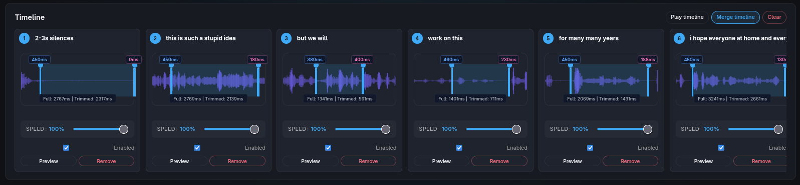
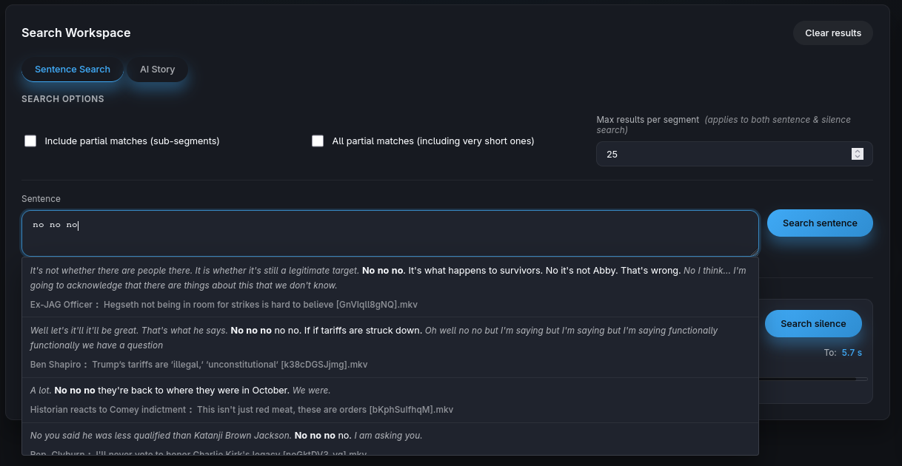
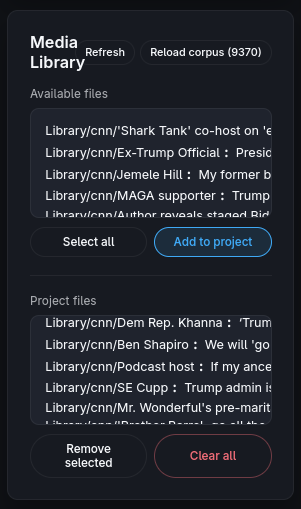
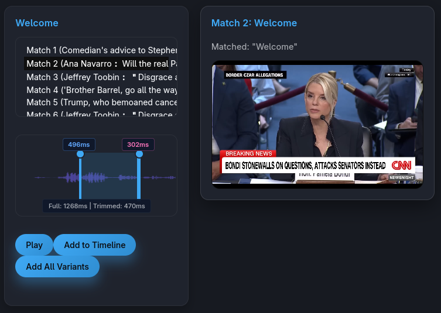
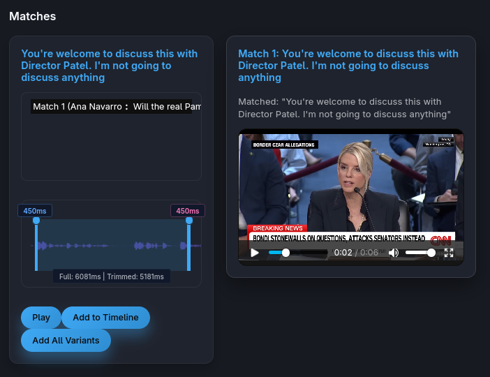

# cinephrase - Video Phrase Extractor

cinephrase is a powerful Flask-based web application for searching, extracting, and compositing video clips based on transcribed speech. Perfect for video editors, content creators, and anyone working with large video collections who needs to find and extract specific spoken phrases.

### Timeline



### Resulting Video


## Overview

cinephrase allows you to:
- Search through transcribed videos by sentence, phrase, or word
- Find moments with specific silence/pause durations between words
- Generate AI-powered video stories from your clip library (very large context required for corpus content puzzling)
- Build video timelines by arranging matched segments
- Adjust playback speed per segment
- Export merged video compilations with GPU acceleration
- Manage multiple projects with saved search preferences
- Realtime saving of all actions

## Features

### 🔍 Advanced Search Capabilities

- **Sentence Search**: Find exact or partial matches of spoken phrases across your video library
- **Silence Search**: Locate clips with specific pause durations (0-10s) between words
- **Partial Match Support**: Find sub-segments within longer phrases
- **Multi-file Search**: Search across multiple video files simultaneously
- **Real-time Streaming Results**: See matches as they're found during search

### 🎬 Video Editing & Timeline

- **Interactive Timeline**: Drag and drop clips to arrange your video sequence
- **Live Preview**: Preview individual clips or entire timeline playback
- **Video Merging**: Export your timeline as a single merged video file
  - GPU-accelerated encoding (NVENC/QSV/AMF) when available
  - Automatic fallback to CPU encoding
  - Concurrent stream limiting for GPU stability (use nvidia-patch for more parallel encoding streams)
- **Clip Manipulation**: Duplicate, delete, and reorder timeline segments

### 🤖 AI Story Generation

- **LLM Integration**: Generate creative video stories from your clip corpus
- **Custom Prompts**: Describe the type of story you want (drama, news, comedy, etc.)
- **Smart Segment Selection**: Prefers longer, more substantial clips
- **Debug Mode**: Inspect the LLM prompt, corpus, and raw responses
- **Manual Response Processing**: Copy prompts to external LLMs and paste responses back

### 📁 Project Management

- **Project System**: Save and load different search sessions
- **Saved Sentences**: Store frequently used search phrases per project
- **Source File Selection**: Choose which video files to search within each project
- **Autosave**: Automatic project state persistence
- **Project Duplication**: Clone projects as starting templates

### 📝 Transcription Support

Use videogrep transcribe feature or https://github.com/cmprmsd/video-transcriber-with-whisper-timestamped for GPU accelerated high quality transcribtions

### 🎯 Silence Filtering

Fine-tune results based on pauses:
- Set minimum/maximum silence duration around matches
- Configure silence checks for short phrases (e.g., 1-2 words)
- Longer segments can bypass silence restrictions

### 📊 Advanced Features

- **Waveform Visualization**: View audio waveforms for clips
- **Corpus Search**: Full-text search across all transcriptions
- **Sentence Autocomplete**: Tab-completion for phrase suggestions from the speech corpus
- **Search Cancellation**: Stop long-running searches mid-process
- **Segment Skipping**: Hide unwanted matches during active searches (partial skip during search)


## Screenshots

### Full UI


### Realtime suggestions


### Media Library


### Many results


### Long sentence search



## Installation

### Prerequisites

- Python 3.8 or higher
- FFmpeg (required for video processing)
- CUDA-capable GPU (optional, for GPU acceleration)

### Step 1: Clone the Repository

```bash
git clone <repository-url>
cd cinephrase
```

### Step 2: Install Python Dependencies

```bash
pip install -r requirements.txt
```

## Usage

### 1. Transcribe Your Videos

Before searching, you need to transcribe your video files to generate word-level timing data.
Use my [video transcriber script](https://github.com/cmprmsd/video-transcriber-with-whisper-timestamped).

### 2. Start the Web Server

```bash
python server.py
```

**Optional arguments:**
```bash
# Custom port
python server.py --port 8080

# Custom source directory
python server.py --source /path/to/videos

# GPU encoding configuration
python server.py --gpustreams 2  # Max concurrent GPU encoding streams
```

The server will:
- Scan the `Library/` directory for videos and their `.json` transcription files
- Start a web server (default: `http://localhost:5000`)
- Auto-detect available GPU encoders

### 3. Using the Web Interface

#### Initial Setup

1. Open `http://localhost:5000` in your web browser
2. Select files from "Available files" and click **"Add to project"**
3. Click **"Load corpus"** to enable full-text autocomplete search

#### Creating a Project

1. Click **"New"** in the Project Picker section
2. Enter a project name
3. Add source files to your project
4. The project auto-saves as you work

#### Searching for Clips

**Sentence Search:**
1. Enter a phrase in the "Sentence" field (e.g., "hello world")
2. Use Tab for autocomplete suggestions (if corpus is loaded)
3. Click **"Search sentence"**
4. Results appear in the Matches section below

**Silence Search:**
1. Adjust the dual-range slider to set min/max silence duration
2. Click **"Search silence"**
3. Find clips with specific pause lengths between words

**Search Options:**
- **Include partial matches**: Find sub-segments within longer phrases
- **All partial matches**: Include very short segments
- **Max results per segment**: Limit matches (default: 25)

#### Building a Timeline

1. Click **"Add to timeline"** on any match card
2. Clips appear in the Timeline section at the top
3. Drag clips to reorder them
4. Use **"Play timeline"** to preview the sequence
5. Click **"Merge timeline"** to export as a single video file
6. Download button is below the preview on the right

#### Using AI Story Generation

1. Switch to the **"AI Story"** tab
2. Enter a story prompt (e.g., "Create a dramatic news story about climate change")
3. Click **"Generate Story"**
4. Review the generated segment list
5. Matches automatically populate (hopefully) based on the AI's selections

**Advanced AI Workflow:**
1. Click **"Copy LLM Prompt"** to get the prompt with corpus
2. Paste into your preferred LLM (Claude, GPT-4, etc.)
3. Copy the JSON response
4. Click **"Insert Response"** and paste the LLM's output
5. Click **"Process Response"** to search for the suggested clips

#### Silence Preferences

Configure pause filtering in the right sidebar:
- **Min silence**: Minimum pause duration to allow (seconds)
- **Max silence**: Maximum pause duration to allow (seconds)
- **Silence checks up to**: Only apply checks to short clips (word count)

Example: Set min=0.2, max=1.5, threshold=2 to require 0.2-1.5s pauses around 1-2 word clips, but allow any pauses for longer phrases.

### 4. Managing Projects

**Save Current Sentence:**
- Saves your current search phrase to the project
- Reusable with one click from "Saved Sentences" list

**Duplicate Project:**
- Creates a copy of the current project
- Useful for creating variants or templates

**Delete Project:**
- Removes the project permanently - yes no going back

## File Structure

```
video-phrase-extractor/
├── server.py                    # Main Flask application
├── requirements.txt             # Python dependencies
├── static/
│   ├── frontend.js              # Web interface logic
│   ├── style.css                # UI styling
│   └── favicon.ico
├── templates/
│   └── index.html               # Main web interface
├── Library/                      # Default video source directory
│   └── (your videos and .json files)
├── data/                        # Project storage
│   └── projects.json
└── temp/                        # Temporary merged videos
```

## GPU Acceleration

The application automatically detects and uses available GPU encoders:

**Supported GPU Encoders:**
- **NVENC** (NVIDIA): h264_nvenc, hevc_nvenc
- **QuickSync** (Intel): h264_qsv, hevc_qsv
- **AMF** (AMD): h264_amf, hevc_amf

**Configuration:**
- `--gpustreams N` - Limit concurrent GPU encoding jobs (default: 2)
- Automatic fallback to CPU (libx264) if GPU fails
- Runtime GPU failure detection and automatic CPU fallback

## Tips & Best Practices

### Transcription Quality

- **Use larger Vosk models** for better accuracy
- **Use [Whisper-Timestamped](https://github.com/cmprmsd/video-transcriber-with-whisper-timestamped)** for highest quality
- **Align high-quality SRT subtitles** with Vosk timings for best of both worlds
- Check audio track language metadata matches your model

### Search Strategies

- **Use semicolon for separation** in searches: "hello; world" creates two separate segments
- **Enable partial matches** to find phrases within longer sentences e.g. "hello from earth" would result in "hello" clips as well as "from earth"
- **Adjust silence preferences** to filter out clips where the pause to the next word is too narrow
- **Save frequently used phrases** to project sentences for quick reuse

## Troubleshooting

### No search results?

- Verify `.json` transcription files exist next to video files
- Check that files are added to your project in the Media Library
- Try enabling "Include partial matches" option
- Verify transcription language matches search text

### GPU encoding fails?

- Check NVIDIA/AMD/Intel drivers are up to date
- Try reducing `--gpustreams` to 1
- Application automatically falls back to CPU encoding
- Check FFmpeg GPU encoder support: `ffmpeg -encoders | grep nvenc`

### Transcription fails?

- Verify FFmpeg is installed: `ffmpeg -version`
- Check video file audio track is not corrupted
- Ensure sufficient disk space for temporary audio files
- For Whisper: Verify PyTorch CUDA installation: `python -c "import torch; print(torch.cuda.is_available())"`

### Web interface issues?

- Clear browser cache and reload
- Check browser console (F12) for JavaScript errors
- Verify server is running: `curl http://localhost:5000`
- Check server terminal for Python errors

## Advanced Configuration

### Custom Source Directory

```bash
python server.py --source /path/to/your/videos
```

### Corpus Text Generation

The "Load corpus" feature generates a searchable text file from all transcriptions:

```python
# Automatic via web UI or manually via endpoint
curl -X POST http://localhost:5000/get_sentences
```

Creates `static/sentences.txt` for autocomplete functionality.

## Development Notes

### Main Components

- **server.py**: Flask routes, video processing, search logic, GPU encoding
- **frontend.js**: Web UI interactivity, drag-and-drop, video player control
- **srt_word_boundaries.py**: Subtitle alignment using difflib sequence matching
- **whisper_gpu_transcribe.py**: Whisper model inference with word-level timestamps

### API Endpoints

- `GET /` - Main web interface
- `GET /get_files` - List available video files
- `POST /search_longest_segments_stream` - Stream sentence search results
- `POST /search_silences_stream` - Stream silence search results
- `POST /merge_videos_stream` - Stream video merge progress
- `POST /generate_story` - AI story generation
- `GET /api/projects` - List all projects
- `POST /api/projects` - Create new project
- `PUT /api/projects/<id>` - Update project
- `DELETE /api/projects/<id>` - Delete project

## Contributing

Contributions are welcome! Areas for improvement:

- UX improvements for drag and drop in the timeline
- Better partial sentence search
- Improving the sentence auto completion to autotab over to the next sentence without splitting (auto semicolon insertion)
- Batch export capabilities
- Video effect support (transitions, filters)

## License

GPL 3

## Credits

Built with:
- [Flask](https://flask.palletsprojects.com/) - Web framework
- [videogrep](https://github.com/antiboredom/videogrep) - Video processing
- [Vosk](https://alphacephei.com/vosk/) - Speech recognition
- [OpenAI Whisper](https://github.com/openai/whisper) - Speech recognition
- [FFmpeg](https://ffmpeg.org/) - Multimedia framework
